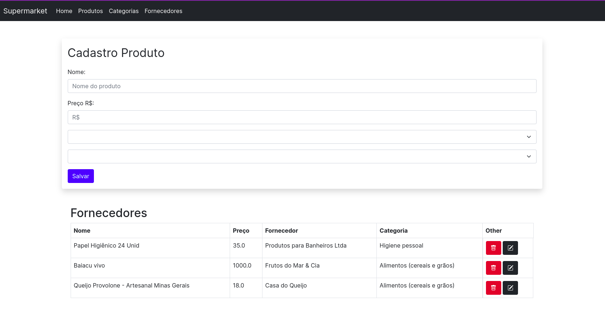

# CRUD SUPERMARKET 

O objetivo deste projeto é demonstrar um sistema básico de gestão de supermercado a fim de reforçar e apresentar meus estudos e experiências adquiridas como bolsista de Desenvolvimento no DTI do Instituto Metrópole Digital. 

---
## Introdução

Desde que soube que fui aceita para fazer parte como bolsista no setor de desenvolvimento do IMD há seis meses, tinha prometido a mim mesma que iria fazer um projeto de código aberto com tudo que eu aprendesse. Do que seria exatamente? Bem... não fazia idéia, mas eis um dia que parei para pensar: "Se eu quisesse fazer um projeto básico e rápido que mostrasse as experiências que adquirir, sem me empolgar tanto a fim de nunca conseguir deixá-lo público no meu github, então... o que seria? Um supermercado, óbvio! 
Então, deixarei esse primeiro protótipo aqui aberto ao público que quiser contribuir e expandí-lo. 

---
## Tecnologias utilizadas

- Java (Spring Boot)
- Thymeleaf
- Bootstrap
- Banco de dados: Postgre
- Testes futuros: JUnit e Mockito
---

## Pré-Requisitos 
- **IDE** (de preferência Eclipse ou Intellij)
- **Banco de dados** (Recomendo utilizar o exemplo exportado no projeto)

--- 

## Variáveis de ambiente utilizadas:

```
DB_URL: jdbc:(banco)://localhost:(port)/(nome do banco)
DB_USERNAME: root
DB_PASSWORD: root
```

### Apresentação em vídeo da primeira versão desenvolvida: 

Clique na imagem
[](https://www.youtube.com/watch?v=idcU00GssGw)